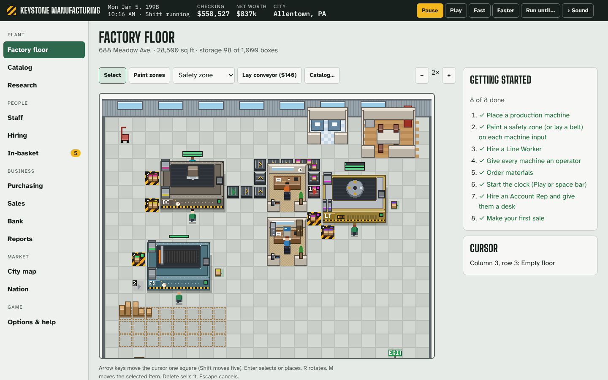
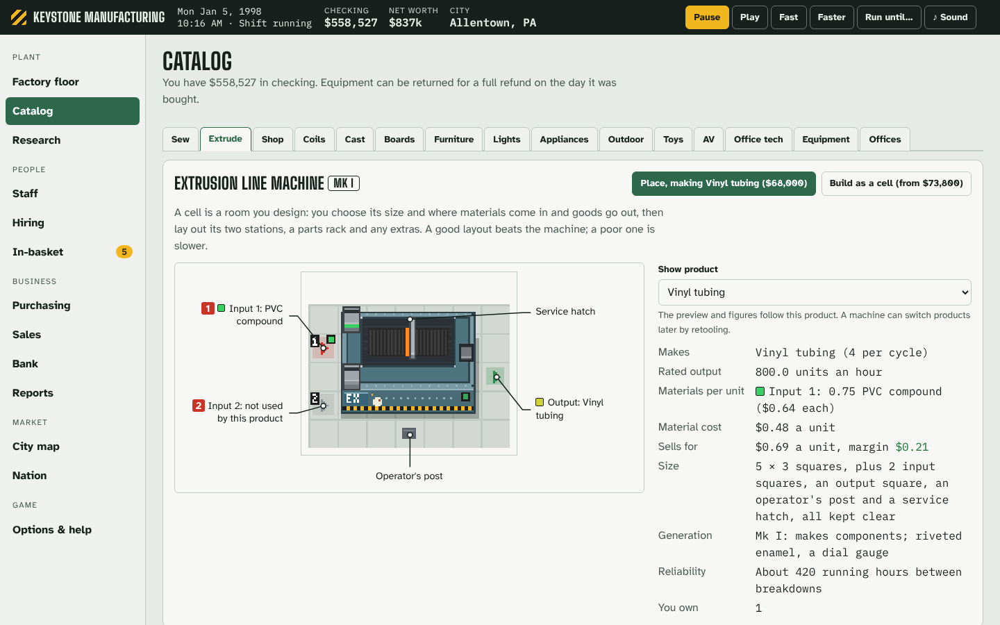
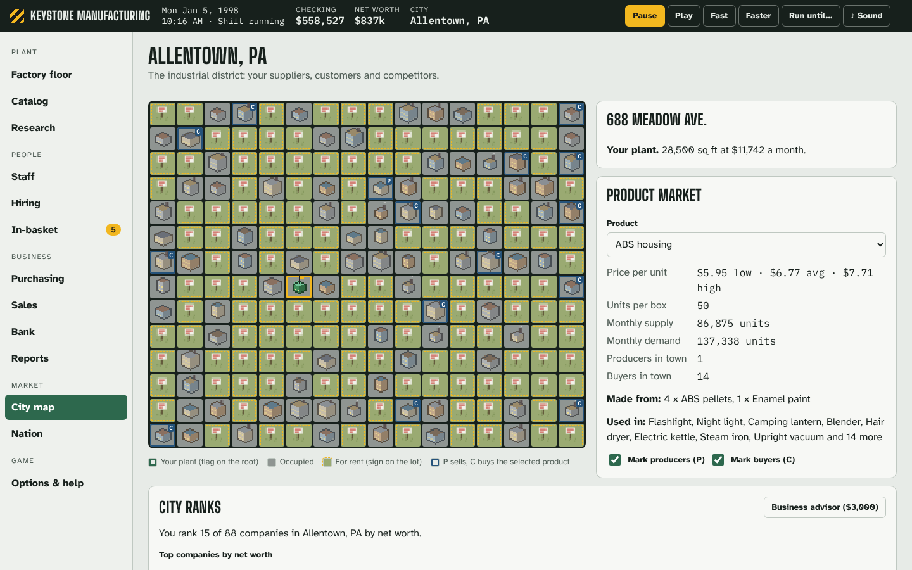

# Overhead

A 90s-style factory management sim that runs in one HTML file.

Lease a plant in one of 42 American cities. Fill it with machines, wire them together with conveyor belts, hire a
crew with real personalities, buy materials from the local market and sell what you make. Start with a single
machine stamping out housings or coils, then build the chain up to lamps, toasters, tents, toys and office machines.



Everything is drawn in code as pixel art. There are no image files, no server and no account. Every screen works with
a keyboard and a screen reader.

## Play

Build it (below) and open `dist/overhead.html` in any modern browser. If GitHub Pages is turned on for the
repository, the latest build is also published there.

- **Quick start** drops you into a mid-sized city with one machine running, a crew hired and materials on order. Press
  Play or the space bar to start the clock.
- **Set up a new company** to choose your starting scenario, difficulty and a scenario number (the same number always
  builds the same cities).

### How it plays

1. **Pick a city.** Bigger cities are bigger markets, but rent and wages cost more.
2. **Lease a building** in the industrial district. Rent is due on the first of each month.
3. **Buy machines** from the Catalog. There are 13 production lines. Six make components from raw materials: extrusion,
   die-casting, coil winding, board assembly, machining, and cut-and-sew. Seven make finished goods: lighting,
   furniture, small appliances, outdoor gear, toys, home electronics and office machines. Each machine needs clear
   input squares, an output square, an operator's post and a service hatch. Paint safety zones on hand-fed inputs.
4. **Hire people.** Line workers run machines. A supervisor speeds up the floor and a mechanic keeps it running.
   Office staff (bookkeepers, buyers, account reps, promoters) each need a desk. Everyone has 31 traits that decide
   how well they fit a job.
5. **Buy and sell.** Materials arrive at your shipping dock and go into storage. Finished goods ship at 3 pm on
   weekdays. Prices move with supply and demand, and your own sales move them too.
6. **Grow.** Belt machines together so components flow straight into product lines. Add pallet jacks and forklifts,
   research new products, design production cells and office suites, and move to a bigger building when you run out
   of floor.

Monthly news shakes things up: supply squeezes, clearance dumps, bulk contracts, heat waves, back-to-school rushes,
freight delays and more.

| | |
|---|---|
|  |  |

## Accessibility

Overhead is built to be played without a mouse and without sight:

- **Keyboard:** every action has a key, and the factory floor is a keyboard grid. Arrows move the cursor, Enter
  selects or places, R rotates, M moves, Delete sells, and Escape cancels. Single-key shortcuts (space to play or
  pause, `[` and `]` for speed, `g` then a letter to jump between screens) can be turned off.
- **Screen readers:** the floor cursor describes every square. Machines, belts and rooms are announced in plain
  language, important events go to live regions, and every chart has a table view.
- **Display:** light, dark and high-contrast themes, four text sizes, and reduced motion. Reduced motion stops
  walking and moving belts.
- **Tested:** the browser tests run axe-core on every screen and fail on any violation.

## Build and test

You need Node.js 20 or later. The browser tests also need Python 3.10 or later.

```
npm install                 # build and test tools: esbuild, us-atlas, d3-geo, topojson, axe-core
npm run build               # data/world.json -> src/gen/data.js -> dist/overhead.html
npm run scan                # content scan (see CONTRIBUTING.md)
npm run test:node           # simulation tests, including the 24-month balance test
pip install playwright && python -m playwright install chromium
npm run test:ui             # browser tests with axe-core accessibility audits
```

Useful extras:

- `node test/long.mjs SEED CITY normal` prints a 24-month game month by month.
- `node test/play.mjs` prints a four-month game with the starter line.
- `python3 test/machine_sheet.py out.png` renders every machine in every rotation.
- `python3 test/readme_shots.py` regenerates the images in `docs/images`.

## How it's made

| Path | What |
|---|---|
| `data/world.json` | The whole game world: production lines, 106 items and 82 recipes, 42 cities, 14 jobs, 31 traits, offices, events, scenarios and economy constants |
| `tools/gen_world.mjs` | Validates the world, prices every made item from its recipe, and writes `src/gen/data.js` |
| `src/sim/` | The simulation: city markets and AI firms, the floor and its placement rules, belts and material flow, people and schedules, money and the bank, production cells, office suites, relocation, monthly events |
| `src/ui/` | The interface: views, the top-down pixel-art renderer, accessible charts, synthesized sound, local saves |
| `docs/design/` | Design notes: [the world](docs/design/world.md), [the economy](docs/design/economy.md) and [the balance targets](docs/design/balance.md) |

The game state is plain JSON. Saves stay in your browser's local storage. Options can export a save file, and the
title screen imports one.

## Licence

- **Code** (everything under `src/`, `tools/` and `test/`): [MIT](LICENSE).
- **Game content, art and writing** (the world data, in-game text, the pixel-art designs and the docs):
  [CC BY 4.0](LICENSE-ASSETS).
- **Third-party work** (us-atlas map data, US Census figures, fonts, build and test tools): see [NOTICE](NOTICE) and
  [data/SOURCES.md](data/SOURCES.md).

Contributions are welcome. Please read [CONTRIBUTING.md](CONTRIBUTING.md) and the
[code of conduct](CODE_OF_CONDUCT.md) first.
